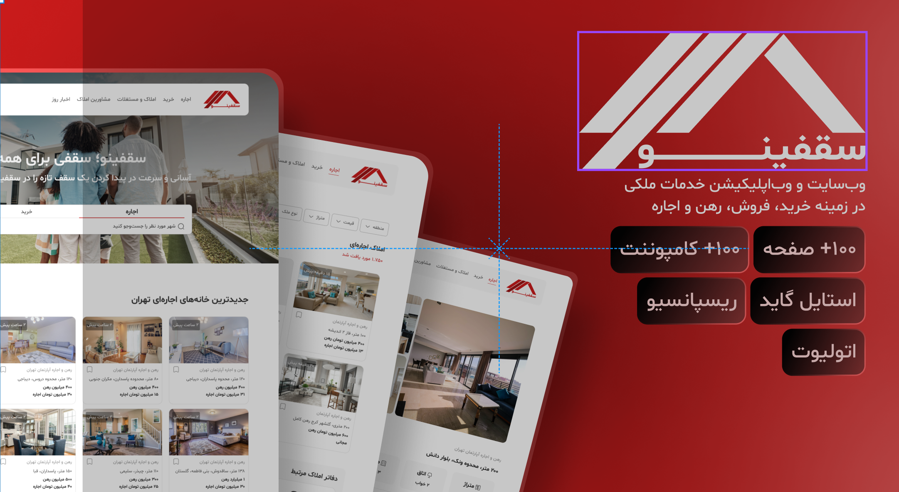

<ol>
  <li>به فولدر <code>frontend</code> بروید.</li>
  <li>دستور <code>npm install</code> را برای نصب وابستگی‌ها اجرا کنید (فقط بار اول نیاز است).</li>
  <li>سپس دستور <code>npm run dev</code> را برای اجرای پروژه بزنید.</li>
</ol>

این دستورات باعث می‌شود پروژه روی سرور محلی اجرا شود و بتوانید آن را در مرورگر مشاهده کنید.

